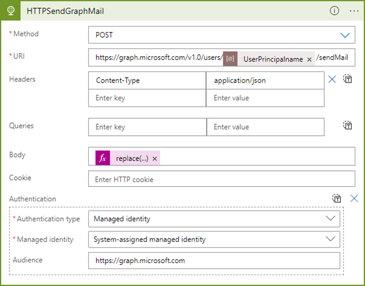

# Secure Apps With Azure - Enable compliant development with Azure

Azure is Microsoft's platform to integrate company applications and workloads into the Microsoft 365and Azure world. If you run applications in the cloud, Azure offers several services to secure them.  

Staying compliant and secure is a key requirement for any cloud solution. Azure provides a wide range of services to help you secure your applications and data. This repository aims to provide some ideas and examples from real life scenarios of using Azure tools, Azure Identity and Platform as a Service, such as App Services, Logic Apps, Key Vault and other Azure resources to protect your data, your applications, and other solutions.  

This information is aimed at administrators and developers who want to learn more about the many services in Microsoft Azure in order to implement their applications and make them secure.

## Azure compliance resources

- If your organization needs to comply with legal or regulatory standards, start here to learn about compliance in Azure https://learn.microsoft.com/en-us/azure/compliance/
- https://azure.microsoft.com/en-us/explore/trusted-cloud/compliance/ 
- https://azure.microsoft.com/en-us/resources/research/ 
- Azure Blueprints https://azure.microsoft.com/en-us/products/blueprints/ 
- Cloud Governance https://learn.microsoft.com/en-us/assessments/b1891add-7646-4d60-a875-32a4ab26327e/ 
- Cloud adoption antipatterns https://learn.microsoft.com/en-us/azure/cloud-adoption-framework/antipatterns/antipatterns-to-avoid 
- Azure compliance https://learn.microsoft.com/en-us/azure/compliance/ 
- SMART Tool https://aka.ms/smarttool 
- Azure Security Center https://learn.microsoft.com/en-us/azure/security-center/	

## Azure Identity

You can find an article how to use a Key Vault with a System Managed Identity and an Azure Logic App at https://blog.atwork.at/post/Azure-Logic-Apps-using-Key-Vault-and-Managed-Identity and the Logic App sample ([here](./LogicApps/GetManager.json).  

## Automate Exchange Online at Scale

This repository includes samples for the session "Automate Exchange Online at Scale" held together with [@magrom](http://twitter.com/magrom) at [Microsoft Exchange Community Airlift](https://mecairlift.event.microsoft.com/ ) in September 2022.

## Using System Managed Identity

In this screenshot, we see an Azure Logic App using a System Managed Identity to access a resource in the Microsoft Graph REST API.

Don´t forget to add the required permissions to the app or to the Azure resource.

## Secure your Azure

We will update this repository from time to time with additional samples. Pls. check blogposts at https://blog.atwork.at with step-by-step How-To´s, such as how to use modern auth with creating a certificate and using that in Azure Automation Accounts and check out this repo from time to time.

Thanks for attending and have fun extending copilot with your own data!  
[Martina Grom](https://twitter.com/magrom) & [Toni Pohl](https://twitter.com/atwork)
